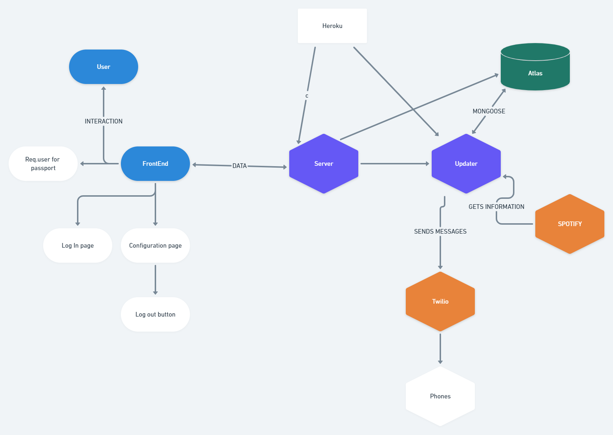

#  🎶 Harmony

#### [Harmony](https://harmonysocial.herokuapp.com/) is a platform that allows users to easily share music and start conversations about the songs they're listening to 

## Features 👀

--- 
> - Users can sign up with spotify (only spotify right now)
> - Users can add their phone number and subscribe to other users 
> - Users get notifications for the songs the users they subscribe to are listening to
> - Users can find other users by sharing links and the Explore page
> - Users can comment on songs 

## 🔮 Future features 🔮
---
> - We will have better privacy and security 
> - Users will be able to add songs to different playlists
> - Songs will be added from multiple platforms (SoundCloud, Apple Music) 
> - Songs will be playable from multiple platforms 
> - We will have an easier way to share profile links 
> - We want to be able to play music from our app 

##  💻 Tech Used 💻

---
 These are the different technologies we are incorporating (MERN stack)

> - React.js ⚛  
> - Express.js 🚄 
> - MongoDB Atlas 💪
> - Mongoose 🐀
> - Spotify API 🟢
> - Twilio API 📲
> - Passport.js 📘
> - Axios 🥅

## Architecture (Subject to change as our needs change)

> - This is a single page application
> - Routing is client side and is triggered by API responses 
> - The notification service is running on a different thread. 

# Contributors

| Diana Gaona                                                                                 | Julian Q                                                                                           | Zipporah Najar                                                                                          |
| ------------------------------------------------------------------------------------------- | -------------------------------------------------------------------------------------------------- | ------------------------------------------------------------------------------------------------------- |
| [Linkedin](https://www.linkedin.com/in/dianacgaona/) [Github](https://github.com/dianacg93) | [Linkedin](https://www.linkedin.com/in/julian-q-379184ba/) [Github](https://github.com/HaxagonusD) | [Linkedin](https://www.linkedin.com/in/zipporah-najar-94bb9b140/) [Github](https://github.com/zeita101) |
| Full stack Engineer - Notifications                                                         | Full Stack Engineer - Infrastructure                                                               | Front End Engineer - Designer                                                                           |
